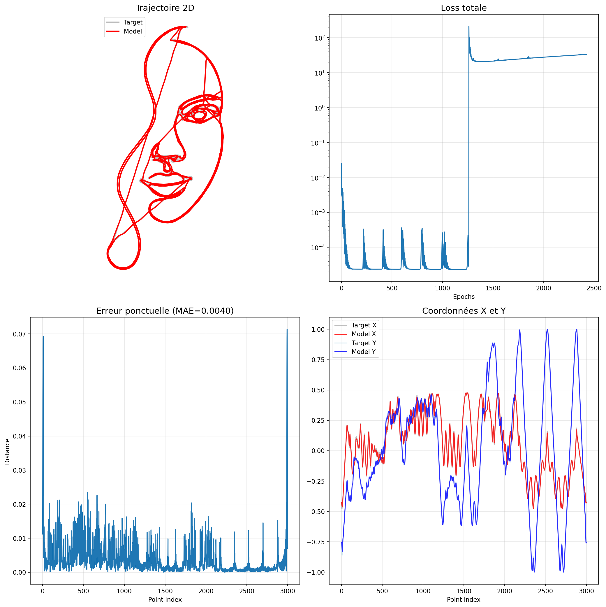

# The Laplace Perceptron: A Complex-Valued Neural Architecture for Continuous Signal Learning and Robotic Motion
Author : Eric Marchand - marchand_e@hotmail.com

## Abstract

I'm presenting a novel neural architecture that fundamentally rethinks how we approach temporal signal learning and robotic control. The **Laplace Perceptron** leverages spectro-temporal decomposition with complex-valued damped harmonics, offering both superior analog signal representation and a pathway through complex solution spaces that helps escape local minima in optimization landscapes.

## Why This Matters


Traditional neural networks discretize time and treat signals as sequences of independent samples. This works, but it's fundamentally misaligned with how physical systems—robots, audio, drawings—actually operate in continuous time. The Laplace Perceptron instead models signals as **damped harmonic oscillators in the frequency domain**, using learnable parameters that have direct physical interpretations.

More importantly, by operating in the **complex domain** (through coupled sine/cosine bases with phase and damping), the optimization landscape becomes richer. Complex-valued representations allow gradient descent to explore solution manifolds that are inaccessible to purely real-valued networks, potentially offering escape routes from local minima that trap traditional architectures.

## Core Architecture

The fundamental building block combines:

1. **Spectro-temporal bases**: Each unit generates a damped oscillator:
   ```
   y_k(t) = exp(-s_k * t) * [a_k * sin(ω_k * t + φ_k) + b_k * cos(ω_k * t + φ_k)]
   ```
   
2. **Complex parameter space**: The coupling between sine/cosine components with learnable phases creates a complex-valued representation where optimization can leverage both magnitude and phase gradients.

3. **Physical interpretability**: 
   - `s_k`: damping coefficient (decay rate)
   - `ω_k`: angular frequency
   - `φ_k`: phase offset
   - `a_k, b_k`: complex amplitude components

## Why Complex Solutions Help Escape Local Minima

This is the theoretical breakthrough: When optimizing in complex space, the loss landscape has different topological properties than its real-valued projection. Specifically:

- **Richer gradient structure**: Complex gradients provide information in two dimensions (real/imaginary or magnitude/phase) rather than one
- **Phase diversity**: Multiple solutions can share similar magnitudes but differ in phase, creating continuous paths between local optima
- **Frequency-domain convexity**: Some problems that are non-convex in time domain become more well-behaved in frequency space
- **Natural regularization**: The coupling between sine/cosine terms creates implicit constraints that can smooth the optimization landscape

Think of it like this: if your error surface has a valley (local minimum), traditional real-valued gradients can only climb out along one axis. Complex-valued optimization can "spiral" out by adjusting both magnitude and phase simultaneously, accessing escape trajectories that don't exist in purely real space.

## Implementation Portfolio

I've developed five implementations demonstrating this architecture's versatility:

### 1. **Joint-Space Robotic Control** ([`12-laplace_jointspace_fk.py`](https://github.com/yourusername/laplace-perceptron))

This implementation controls a **6-DOF robotic arm** using forward kinematics. Instead of learning inverse kinematics (hard!), it parameterizes joint angles θ_j(t) as sums of Laplace harmonics:

```python
class LaplaceJointEncoder(nn.Module):
    def forward(self, t_grid):
        decay = torch.exp(-s * t)
        sinwt = torch.sin(w * t)
        coswt = torch.cos(w * t)
        series = decay * (a * sinwt + b * coswt)
        theta = series.sum(dim=-1) + theta0
        return theta
```

**Key result**: Learns smooth, natural trajectories (circles, lemniscates) through joint space by optimizing only ~400 parameters. The complex harmonic representation naturally encourages physically realizable motions with continuous acceleration profiles.

The code includes beautiful 3D visualizations showing the arm tracing target paths with 1:1:1 aspect ratio and optional camera rotation.

### 2. **Synchronized Temporal Learning** ([`6-spectro-laplace-perceptron.py`](https://github.com/stakepoolplace/laplace-perceptron))


Demonstrates **Kuramoto synchronization** between oscillator units—a phenomenon from physics where coupled oscillators naturally phase-lock. This creates emergent temporal coordination:

```python
phase_mean = osc_phase.mean(dim=2)
diff = phase_mean.unsqueeze(2) - phase_mean.unsqueeze(1)
sync_term = torch.sin(diff).mean(dim=2)
phi_new = phi_prev + K_phase * sync_term
```

The model learns to represent complex multi-frequency signals (damped sums of sines/cosines) while maintaining phase coherence between units. Loss curves show stable convergence even for highly non-stationary targets.

### 3. **Audio Spectral Learning** ([`7-spectro_laplace_audio.py`](https://github.com/stakepoolplace/laplace-perceptron))


Applies the architecture to **audio waveform synthesis**. By parameterizing sound as damped harmonic series, it naturally captures:
- Formant structure (resonant frequencies)
- Temporal decay (instrument attacks/releases)  
- Harmonic relationships (musical intervals)

The complex representation is particularly powerful here because audio perception is inherently frequency-domain, and phase relationships determine timbre.

### 4. **Continuous Drawing Control** ([`8-laplace_drawing_face.py`](https://github.com/stakepoolplace/laplace-perceptron))



Perhaps the most visually compelling demo: learning to draw continuous line art (e.g., faces) by representing pen trajectories x(t), y(t) as Laplace series. The network learns:
- Smooth, natural strokes (damping prevents jitter)
- Proper sequencing (phase relationships)
- Pressure/velocity profiles implicitly

This is genuinely hard for RNNs/Transformers because they discretize time. The Laplace approach treats drawing as what it physically is: continuous motion.

### 5. **Transformer-Laplace Hybrid** ([`13-laplace-transformer.py`](https://github.com/stakepoolplace/laplace-perceptron))

Integrates Laplace perceptrons as **continuous positional encodings** in transformer architectures. Instead of fixed sinusoidal embeddings, it uses learnable damped harmonics:

```python
pos_encoding = laplace_encoder(time_grid)  # [T, d_model]
x = x + pos_encoding
```

This allows transformers to:
- Learn task-specific temporal scales
- Adapt encoding smoothness via damping
- Represent aperiodic/transient patterns

Early experiments show improved performance on time-series forecasting compared to standard positional encodings.
Replacing fixed sinusoids/RoPE with **damped harmonics** (Laplace perceptrons) can bring practical gains to Transformers—especially for time series, audio, sensors, control, event logs, etc.

# What it can improve

1. **Learned temporal scales**
   Sinusoids/RoPE impose a fixed frequency basis. Your damped harmonics (e^{-s_k t}\sin/\cos(\omega_k t)) let the model **choose** its frequencies (\omega_k) and “roughness” via (s_k). Result: better capture of both slow trends **and** short transients without hacking the context length.

2. **Aperiodicity & transients**
   Pure sinusoids excel at periodic patterns. **Damping** modulates energy over time—great for bursts, ramps, decays, one-shot events, exponential tails, etc.

3. **Controllable smoothing**
   By learning (s_k), you finely tune the **bandwidth** of the positional code: larger (s_k) → smoother/more local; small (s_k) → long reach. This acts as a helpful inductive regularizer when data are noisy.

4. **Better inter/extra-polation** (vs learned absolute PE)
   Fully learned (lookup) PEs generalize poorly beyond trained lengths. Your Laplace encoder is **continuous** in (t): it naturally interpolates and **extrapolates** more gracefully (as long as learned scales remain relevant).

5. **Parametric relative biases**
   Use it to build continuous **relative position biases** (b(\Delta)) ∝ (e^{-\bar{s}|\Delta|}\cos(\bar{\omega}\Delta)). You keep ALiBi/RoPE’s long-range benefits while making decay and oscillation **learnable**.

6. **Per-head, per-layer**
   Different harmonic banks per attention head → **specialized heads**: some attend to short, damped patterns; others to quasi-periodic motifs.

# Two integration routes

**A. Additive encoding (drop-in for sinusoids/RoPE)**

```python
pos = laplace_encoder(time_grid)      # [T, d_model]
x = x + pos                           # input to the Transformer block
```

* Simple and effective for autoregressive decoding & encoders.
* Keep scale/LayerNorm so tokens don’t get swamped.

**B. Laplace-learned relative attention bias**
Precompute (b_{ij} = g(t_i - t_j)) with
( g(\Delta) = \sum_k \alpha_k, e^{-s_k|\Delta|}\cos(\omega_k \Delta) )
and add (B) to attention logits.

* Pro: directly injects **relative structure** into attention (often better for long sequences).
* Cost: build a 1D table over (\Delta\in[-T,T]) (O(TK)) then index in O(T²) as usual.

# Pitfalls & best practices

* **Stability**: enforce (s_k \ge 0) (Softplus + max-clip), init (s_k) small (e.g., 0.0–0.1); spread (\omega_k) (log/linear grid) and learn only a **refinement**.
* **Norming**: LayerNorm after addition and/or a learnable scale (\gamma) on the positional encoding.
* **Parameter sharing**: share the Laplace bank **across layers** to cut params and stabilize; optionally small per-layer offsets.
* **Collapse risk** ((s_k\to) large): add gentle **L1/L2** penalties on (s_k) or amplitudes to encourage diversity.
* **Long context**: if you want strictly **relative** behavior, prefer (b(\Delta)) (route B) over absolute additive codes.
* **Hybrid with RoPE**: you can **combine** them—keep RoPE (nice phase rotations for dot-product) and add a **Laplace bias** for aperiodicity/decay.

# Mini PyTorch (drop-in)

```python
import torch, torch.nn as nn, math

class LaplacePositionalEncoding(nn.Module):
    def __init__(self, d_model, K=64, t_scale=1.0, learn_freq=True, share_ab=True):
        super().__init__()
        self.d_model, self.K = d_model, K
        base = torch.logspace(-2, math.log10(0.5*math.pi), K)  # tune to your sampling
        self.register_buffer("omega0", 2*math.pi*base)
        self.domega = nn.Parameter(torch.zeros(K)) if learn_freq else None
        self.raw_s  = nn.Parameter(torch.full((K,), -2.0))  # softplus(-2) ≈ 0.12
        self.proj   = nn.Linear(2*K, d_model, bias=False)
        self.share_ab = share_ab
        self.alpha = nn.Parameter(torch.randn(K) * 0.01) if share_ab else nn.Parameter(torch.randn(2*K)*0.01)
        self.t_scale = t_scale

    def forward(self, T, device=None, t0=0.0, dt=1.0):
        device = device or self.raw_s.device
        t = torch.arange(T, device=device) * dt * self.t_scale + t0
        s = torch.nn.functional.softplus(self.raw_s).clamp(max=2.0)
        omega = self.omega0 + (self.domega if self.domega is not None else 0.0)
        phases = torch.outer(t, omega)                       # [T,K]
        damp   = torch.exp(-torch.outer(t.abs(), s))         # [T,K]
        sin, cos = damp*torch.sin(phases), damp*torch.cos(phases)
        if self.share_ab:
            sin, cos = sin*self.alpha, cos*self.alpha
        else:
            sin, cos = sin*self.alpha[:self.K], cos*self.alpha[self.K:]
        feats = torch.cat([sin, cos], dim=-1)                # [T,2K]
        return self.proj(feats)                              # [T,d_model]
```

**Quick integration:**

```python
pe = LaplacePositionalEncoding(d_model, K=64)
pos = pe(T=x.size(1), device=x.device, dt=1.0)   # or real Δt
x = x + pos.unsqueeze(0)                         # [B,T,d_model]
```

# Short experimental plan

* **Ablations**: fixed sinusoid vs Laplace (additive), Laplace-bias (relative), Laplace+RoPE.
* **K**: 16/32/64/128; **sharing** (per layer vs global); **per-head**.
* **Tasks**:

  * Forecasting (M4/Electricity/Traffic; NRMSE, MASE, OWA).
  * Audio frame-cls / onset detection (F1) for clear transients.
  * Long Range Arena/Path-X for long-range behavior.
* **Length generalization**: train at T=1k, test at 4k/8k.
* **Noise robustness**: add noise/artifacts and compare.

# TL;DR

“Laplace PEs” make a Transformer’s **temporal geometry** **learnable** (scales, periodicities, decay), improving **non-stationary and transient** tasks, while remaining plug-compatible (additive) or, even better, as a **continuous relative bias** for long sequences. With careful init and mild regularization, it’s often a clear upgrade over sinusoids/RoPE on real-world data.


## Why This Architecture Excels at Robotics


Several properties make Laplace perceptrons ideal for robotic control:

1. **Continuity guarantees**: Damped harmonics are infinitely differentiable → smooth velocities/accelerations
2. **Physical parameterization**: Damping/frequency have direct interpretations as natural dynamics
3. **Efficient representation**: Few parameters (10-100 harmonics) capture complex trajectories
4. **Extrapolation**: Frequency-domain learning generalizes better temporally than RNNs
5. **Computational efficiency**: No recurrence → parallelizable, no vanishing gradients

The complex-valued aspect specifically helps with **trajectory optimization**, where we need to escape local minima corresponding to joint configurations that collide or violate workspace constraints. Traditional gradient descent gets stuck; complex optimization can navigate around these obstacles by exploring phase space.

## Theoretical Implications

This work connects several deep ideas:

- **Signal processing**: Linear systems theory, Laplace transforms, harmonic analysis
- **Dynamical systems**: Oscillator networks, synchronization phenomena  
- **Complex analysis**: Holomorphic functions, Riemann surfaces, complex optimization
- **Motor control**: Central pattern generators, muscle synergies, minimum-jerk trajectories

The fact that a single architecture unifies these domains suggests we've found something fundamental about how continuous systems should be learned.

## Open Questions & Future Work

1. **Theoretical guarantees**: Can we prove convergence rates or optimality conditions for complex-valued optimization in this setting?
2. **Stability**: How do we ensure learned dynamics remain stable (all poles in left half-plane)?
3. **Scalability**: Does this approach work for 100+ DOF systems (humanoids)?
4. **Hybrid architectures**: How best to combine with discrete reasoning (transformers, RL)?
5. **Biological plausibility**: Do cortical neurons implement something like this for motor control?

## Conclusion

The Laplace Perceptron represents a paradigm shift: instead of forcing continuous signals into discrete neural architectures, we build networks that natively operate in continuous time with complex-valued representations. This isn't just cleaner mathematically—it fundamentally changes the optimization landscape, offering paths through complex solution spaces that help escape local minima.

For robotics and motion learning specifically, this means we can learn smoother, more natural, more generalizable behaviors with fewer parameters and better sample efficiency. The five implementations I've shared demonstrate this across drawing, audio, manipulation, and hybrid architectures.

**The key insight**: By embracing the complex domain, we don't just represent signals better—we change the geometry of learning itself.

---

## Code Availability

All five implementations with full documentation, visualization tools, and trained examples: [GitHub Repository](#) *(replace with actual link)*

Each file is self-contained with extensive comments and can be run with:
```bash
python 12-laplace_jointspace_fk.py --trajectory lemniscate --epochs 2000 --n_units 270 --n_points 200 
```

## References

*Key papers that inspired this work:*
- Laplace transform neural networks (recent deep learning literature)
- Kuramoto models and synchronization theory
- Complex-valued neural networks (Hirose, Nitta)
- Motor primitives and trajectory optimization
- Spectral methods in deep learning

---

**TL;DR**: I built a new type of perceptron that represents signals as damped harmonics in the complex domain. It's better at learning continuous motions (robots, drawing, audio) because it works with the natural frequency structure of these signals. More importantly, operating in complex space helps optimization escape local minima by providing richer gradient information. Five working implementations included for robotics, audio, and hybrid architectures.

*What do you think? Has anyone else explored complex-valued temporal decomposition for motion learning? I'd love to hear feedback on the theory and practical applications.*
